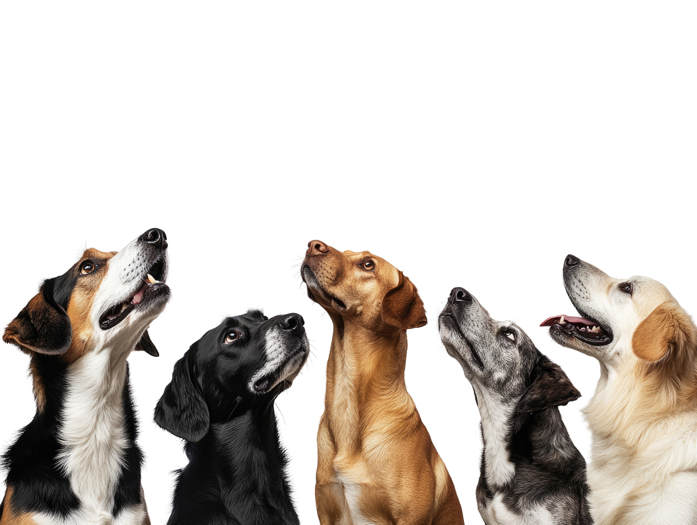

# Actividad: Conociendo perritos 🐶
## Objetivos 🎯
- Aprender a trabajar con Git y GitHub en equipo.
- Familiarizarse con comandos básicos de Git: clone, add, commit, push, pull.
- Desarrollar una página web sencilla que muestra perritos aleatorios usando una API.
- Trabajar colaborativamente sobre un mismo proyecto. 

---

## 🚀 Descripción

En esta actividad, en equipos de 5 personas, deberán completar una página web que muestra **imágenes aleatorias de perritos** usando la **Dog API**. El HTML ya está creado: deben enfocarse en completar el archivo JavaScript (siguiendo las instrucciones comentadas) y aplicar estilos con CSS.

---

## 📂 Archivos del proyecto

- `index.html`: estructura completa (NO modificar)
- `style.css`: aplicar los estilos requeridos (Opcional)
- `script.js`: completar la funcionalidad con los comentarios guía

---

## 🌐 URL de la API

Usarán esta API para obtener imágenes aleatorias de perritos: https://dog.ceo/api/breeds/image/random 

---
## 🧭 Mini guía: Primeros pasos con Git y GitHub 

1. **Clonar el repositorio base:** Un integrante del equipo debe clonar el repositorio base que compartió el tutor.
```bash
git clone URL REPOSITORIO
cd nombre-de-carpeta
```

2. **Crear un repositorio nuevo del equipo en GitHub:** El integrante que clonó el repositorio base debe crear un repositorio nuevo en su cuenta

3. **Subir el proyecto base al nuevo repositorio:** Cambiar la URL remota y subir los archivos:
```bash
git remote set-url origin URL DEL REPOSITORIO DEL EQUIPO
git push -u origin main
```

4. **Los demás integrantes del equipo clonan ese nuevo repositorio:** Cada estudiante del equipo debe clonar el repositorio del equipo:
```bash
git clone URL REPOSITORIO DEL EQUIPO
cd nombre-de-carpeta
```

5. **Crear una rama personal para trabajar:** Antes de hacer cambios, cada integrante crea una rama con su nombre o tarea:
```bash
git checkout -b nombre-rama
```

6. **Hacer cambios, guardar y registrar:** Editar los archivos, guardar los cambios y registrar los cambios con Git:
```bash
git add .
git commit -m "Agrego funcionalidad para mostrar perrito"
```

7. **Subir los cambios a GitHub (push)**
```bash
git push origin nombre-rama
```

8. **Abrir un Pull Request:** 
    - Van al repositorio del equipo en GitHub.
    - Les va a aparecer un botón que dice “Compare & pull request”.
    - Hacen clic y explican qué cambiaron.
    - Otro compañero (o todos juntos) revisan y hacen "Merge" a la rama main.

9. **Actualizar el repositorio local:** Una vez que los cambios fueron aprobados y combinados, el resto del equipo puede actualizar su rama principal:
```bash
git checkout main
git pull origin main
```


## 💻 Comandos de Git a utilizar

```bash
git clone <url-del-repo>      # Clonar el repositorio
git status                    # Verificar el estado de los archivos
git add .                     # Agregar los cambios
git commit -m "Descripción"  # Crear un commit
git push                      # Subir cambios a GitHub
git pull                      # Traer cambios si otro integrante ya hizo push
cd nombre-de-carpeta #Cambia de carpeta (directorio)
```

